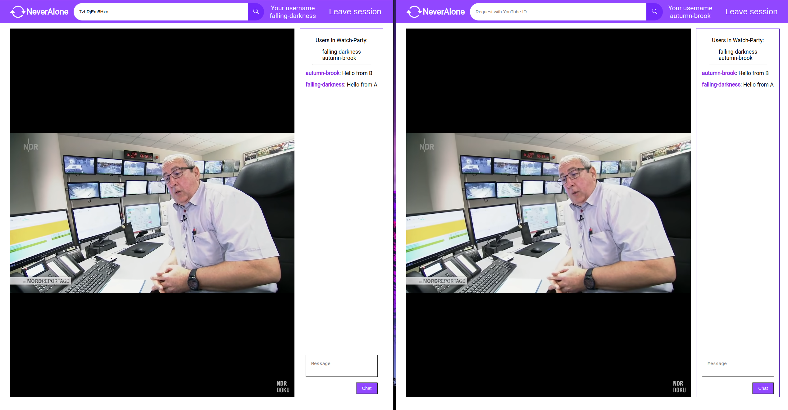

# neveralone

## Introduction

neveralone is a web service which allows you to watch YouTube videos together with your friends.

## How does it work

Every user joins a room then the playback of the videos is synchronized between all open sessions.

## Example preview

## Routes

### /

landing page

### POST /party

create a party

### GET /party/id

join a party